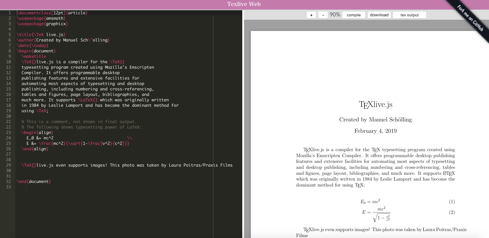

# Texlive-Web
Web client standalone tex editor using [texlivejs](http://manuels.github.io/texlive.js/) 


## [Demo](https://texlive-web.tk/)


## Dependencies
- texlive.js
- Vue
- Vuex

## Build Setup

``` bash
# clone repo
git clone --recursive https://github.com/moritanian/texlive-web.git
cd texlive-web

# install dependencies
npm install

# serve with hot reload at localhost:8080
npm run dev

# build for production with minification
npm run build

# build for production and view the bundle analyzer report
npm run build --report

# run unit tests
npm run unit

# run e2e tests
npm run e2e

# run all tests
npm test
```
